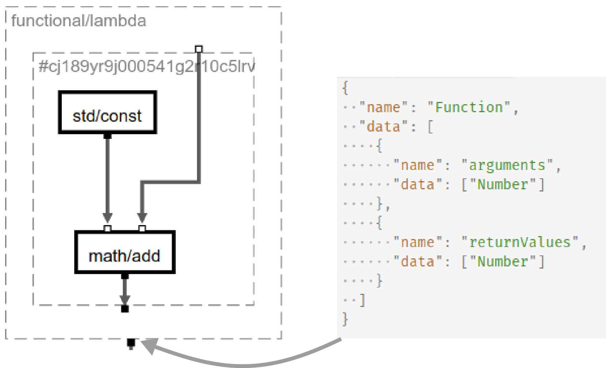

# Buggy Diary – April-01

The last iteration mostly focused on creating a robust typing and working
source code.

## Typify

Most recent version of typify is now: 0.1.8.

Typify got a few new features. A short reminder: typify is responsible
for propagating types through the graph and for complaining if there are
inconsistencies.

### Lambda Functions in Typify

One feature that is new in typify is the association between an
implementation of a lambda function and its type. The Lambda node
propagates a function but contains a graph as its implementation.
The graph implementation must be represented as a special type.
The following example illustrates the corresponding type of
the lambda implementation on the output port of the lambda node:



On the left is the lambda node and the implementation on the right
is the type represented as a JSON object. The `Function` type on the
right is in no way special. Every non-basic type has a similar
form. But the function type will be handled differently in code
generation process (depending on the target language).

### Unification of rest parameters

Typify supported the unification of complex type objects that could
be nested arbitrarily. But in order to type a partial function rest
parameters were necessary.
The following example illustrates how rest parameters are used to create
assignments for further typings:

```js
import * as Unify from '@buggyorg/typify/lib/unify'
const t1 = {
  name: 'T1'
  data: ['first', '...rest']
}
const t2 = {
  name: 'T2'
  data: ['Number']
}
const t3 = {
  name: 'T3'
  data: ['String', 'Number', 'Boolean']
}

const assign1 = Unify.UnifyTypes(t1, t2)
/*
 assign1 = {
   first: 'Number',
   rest: []
 }
*/

const assign2 = Unify.UnifyTypes(t1, t3)
/*
 assign2 = {
   first: 'String',
   rest: ['Number', 'Boolean']
 }
*/

```

The `UnifyTypes` method creates an assignment for the
type names (`first` and `rest`), where `rest` is a
rest parameter. The rest parameter unifies to an arbitrary list
of types (even an empty list as demonstrated by `assign1`).

This functionality is needed for the typification of an partial
node. The ports of a partial node are as follows:

```js
"ports": [
  {
    "port": "fn",
    "kind": "input",
    "type": {
      "name": "Function",
      "data": [
        {
          "name": "arguments",
          "data": [
            "first",
            "...rest"
          ]
        },
        // ...
      ]
    }
  },
  {
    "port": "value",
    "kind": "input",
    "type": "first"
  },
  {
    "port": "outFn",
    "kind": "output",
    "type": {
      "name": "Function",
      "data": [
        {
          "name": "arguments",
          "data": "rest"
        },
        // ...
      ]
    }
  }
]
```

Here you can see, that the input function (first port) is a function
with a `first` argument type and `...rest` (a list of further types).
The partial node has another input port `value` that takes the bind
value. This value must have a type that fits to `first`. The output
of the partial node is a function that lacks the `first` parameter and
only has the `rest` parameter list. Note that `['...rest']` would be
equivalent to `'rest'` in the output functions arguments.

### Types of constants

A constant node has a constant stored in its meta data and
this constant implies a type (that is already guessed by lisgy).
Typify did not use this information prior to [a48951...](https://github.com/BuggyOrg/typify/commit/a48951ed8a97771813d6da144c9a084ccb130e8e). The type usually propagated from somewhere else and everything
was fine. But this avoids a consistency check. The propagated type may
not correspond to the constants value type. This is why we added a
specific rule to associate the constants type to the output port.

To improve error messages I moved the rewrite rule for constants to the
top, as those usually are correct and type errors occur due to
wrong connections. Thus we want an error message indicating the connection
has invalid typings and not the constant value is incorrectly typed.

### Future work

An important goal for the next iteration is typing recursive nodes correctly.
Furthermore we need tests for inconsistent typings. The constant typings showed
that it was possible to create inconsistent typings with typify without
any warnings. Typify did not notice the problem. This must improve and requires
some thorough testing. Inconsistent typings can be confusing if not caught early
in the pipeline with good error messages.

## Codegen

The codegen project creates source code for typed graphs. It is currently not published as it is still under heavy development. The first release is expected in the next iteration cycle. Currently we support C++ as a target language. The
command:

```
node codegen/lib/cli.js -l codegen/languages/c -l codegen/languages/c-like
```

Creates code in C++, where the `-l` parameter specifies the language definition
or extensions. The `c-like` definition includes a basic structure for C-like
languages (e.g. C++, JavaScript or similar). In the last iteration we
implemented vital features for the support of lambda functions. They represent
not only a nice way of creating abstractions, we also use them to
implement the `if` *special form*. The `if` atomic gets two inputs values and
a `choice` boolean that decides which value gets propagated. To reduce
unnecessary calculations and to enable recursive functions both
branches of the `if` input are converted into lambda functions which
are only evaluated if their branch is chosen by the `choice` input.

### Lambda Functions

A Lambda Function is a special type as discussed in the [Typify section](#lambda-functions-in-typify). This means we need a special handling
for lambda functions as types. This can be found [here](https://github.com/BuggyOrg/codegen/blob/master/languages/c/templates/types.js#L10). We currently use `std::function` as it supports binding values
to it. We need this for the implementation of `partial`. A lambda function
simply takes the component implementation and turns it into a
`std::function` object ([relevant implementation](https://github.com/BuggyOrg/codegen/blob/master/languages/c/atomics/functional.js)).

### Future Work

In the next iteration we will aim to implement the following features:

 - **Recursive functions**: This is the next feature to come. Everything is set
  up for recursive functions (i.e. lambda functions and if-rewrites to thunks).
  There are only two missing links: Typing of recursive functions and
  code generation.
 - **Support duplication**: Currently the semantics of the generated code is
  not quite right, we need to copy values in key places. Coptify implemented
  duplication of values if a port output is used multiple times. The next
  step is add the duplication into the code generator.
 - **Array support**: Array data types are quite important for most algorithms
  *codegen* has up to now, no support for array types. But this will come soon.
 - **Recursive data types**: After recursive functions are implemented we
  will also test recursive data types which in theory could already work, but
  are not yet tested.
 - **Documentation**: Codegen needs at least a concise documentation of key
  features to reduce friction when working with it.

## Coptify

Coptify implemented a rather simple method for value duplication with no
optimized reference usage. This is necessary to create semantically correct
code (in all cases) in codegen. We will focus on improving the usage of
references where possible in the next iterations.

## Buggy-CLI

The API for Buggy-CLI got more usable. It is currently used in racer to
generate all kinds of outputs. There were a few race conditions when
installing a npm package through multiple instances. This is why we
added a locking mechanism to prevent concurrent installs. Most issues from
the last iteration remain for Buggy-CLI as they have a lower priority for now.

## Graphtools

Most recent version: `0.4.0-pre.29`. No major changes were introduced during the last iteration.

### Bugs

The following bugs have been fixed:

 - `replacePort`: Due to the stange behaviour of lodash `merge` we had
  problems when replacing ports in which arrays were updated (shortened).
  The following example illustrates the problem:
  ```js
  merge(['a', 'b'], ['c']) // => ['c', 'b']
  ```

  The array is not replaced. Only the prefix is changed and everything else
  is kept. An `omit` and `Object.assign` should fix this problem.

  [Commit](https://github.com/BuggyOrg/graphtools/commit/cc36be6f2e6ab02fb57a61898b8339c4c75cdd2e)

### Typescript Rewrite/Refactoring

We tried to rewrite the *Graphtools* API with typescript to enable
better error messages due to the typescripts compiler. The typescript
type system is not optimal as it does not fully support currying.

<!--One implication is, that we decided to remove most of the curried
functions and replace them with non-curried functions. But to
keep most of the idea of the API intact we splitted some functions into
functions, returning functions. Especially for the flow API. The
flow now takes an array of `GraphAction`s which are simply functions
that take a `Portgraph` and return a `Portgraph`. A `GraphAction`
has an optional second parameter, a callback function:

```typescript
type GraphCallback = (payload, g:Portgraph) => Portgraph
```
-->

We designed a new typescript API that can be used in a OOP way and
a functional one. Both are built upon the working implementation.
Due to other more important issues we put this work into the 
[typescript-rewrite-rewrite](https://github.com/BuggyOrg/graphtools/tree/typescript-rewrite-rewrite)
branch. (The first branch was a failed attempt to reimplement everything
with typescript).
