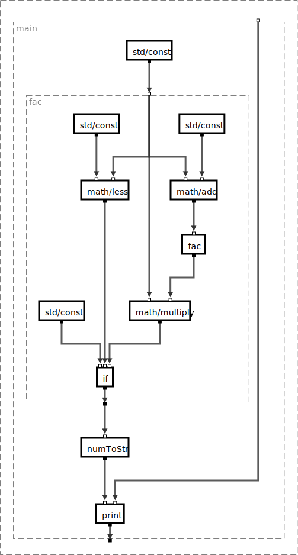
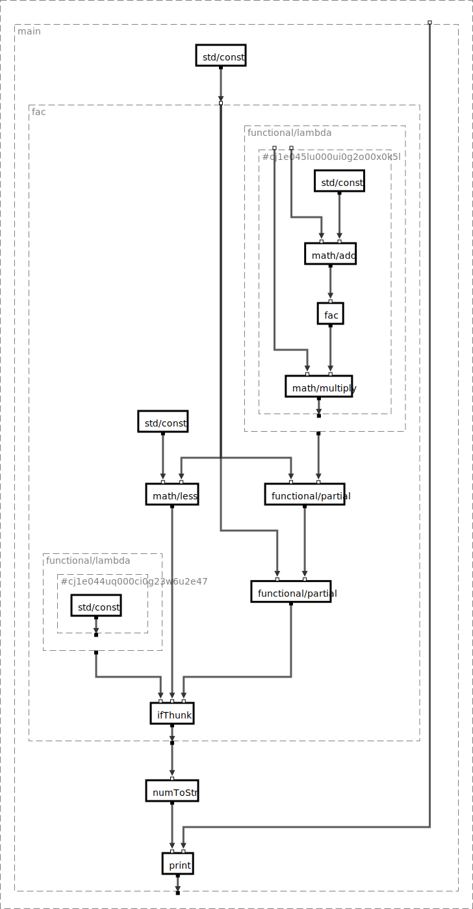

# Buggy Diary – WIP

## Graphtools

### Handling of meta data

Currently it was rather clunky to change the meta information of a
node. It was only possible to change the meta information of the
graph or change the meta information of the node and then replace
the node manually. This iteration brings a few new functions that
help coping with meta information. Namely

 - `Graph.setNodeMeta`
 - `Graph.removeNodeMeta`
 - `Graph.updateNodeMeta`
 - `Graph.getNodeMeta`

They change the meta information of a node and return the new graph
containing the updated node. Furthermore there is now a distinction
between `set` and `update`. Up to 0.4.0-pre.29 set usually extended
a value if it was an object type. Now set always removes old
values und sets the given value as the meta information
(as indicated by the name and documentation) and update on the other
hand extends object values. Consider the following example:

```
const g1 = Graph.setNodeMeta('key', {a: 'v1'}, 'node', g)
const g2 = Graph.setNodeMeta('key', {b: 'v2'}, 'node', g1)
const g3 = Graph.updateNodeMeta('key', {b: 'v2'}, 'node', g1)
```

In this example the key `key` is set to a new value (`g2`) or
is updated (`g3`). In the first case the value stored at `key`
is only `{b: 'v2'}` and the value for `a` is removed. In the
second case (`g3`) the meta information is updated and the
new value is `{a: 'v1', b: 'v2'}`.

## thunkIf

We added a new package in the last iteration, namely *thunkIf*.
This package tackles the problem of a data flow driven if with
recursive calls. It is impossible to calculate all data paths in a
recursive node as those would require infinite computing power.
Consider the factorial node:

<center></center>

The `fac` node is shown as a compound node and as a atomic node.
In fact `fac` is a recursive implementation and the outer
`fac` node is the definition of this node. The inner `fac` node
(with a solid border) is like `recur` in Clojure. It calls the
same definition of `fac`, but with the data stemming from inside the
recursive call.

This is a problem for the data flow interpretation. It is
impossible to calculate all recursive levels (and unnecessary), we
(usually) need only a finite number of recursions, but we cannot always
statically decide how deep the recursion will go. To circumvent this
*thunkIf* finds all `if` components, identifies the lowest common
ancestor (LCA, [more on that](https://github.com/BuggyOrg/diary/blob/master/2017_03/1/10_03_2017.md#algorithm)) and takes all nodes in between the if and the LCA and bundles those inside a
lambda function. This results in the following graph for our `fac` example.

<center></center>

### Improvements

Always creating lambda functions creates a lot of overhead. Thus
it would be nice to reduce the number of functions. E.g. we can
simply use a normal `if` in all non-recursive cases. And for recursive cases
it is possible to find cases where we can write a simple if instruction.
